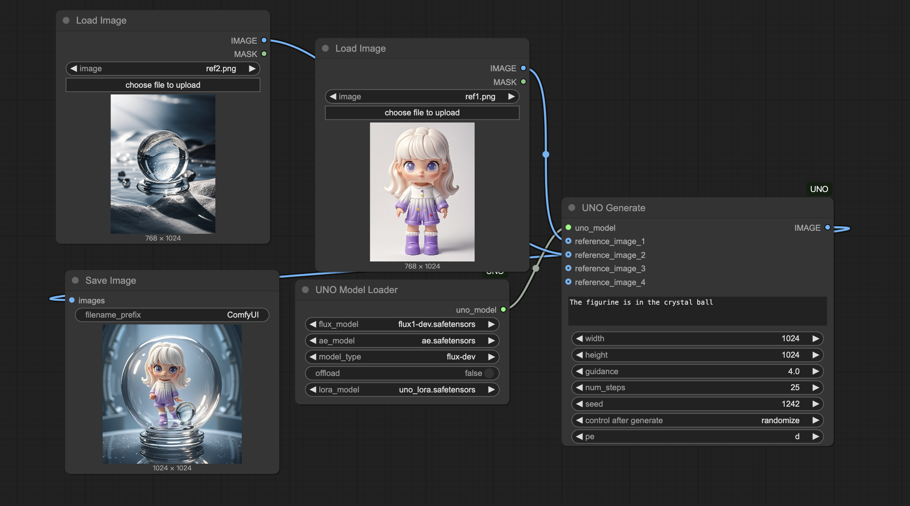

# ComfyUI UNO Nodes

ComfyUI UNO Nodes is a collection of nodes for ComfyUI that allows you to load and use UNO models.

https://github.com/bytedance/UNO comfyui

FP8 support
open offload and fp8 support 24GB VRAM

model url and path
flux model: https://huggingface.co/black-forest-labs/FLUX.1-dev/blob/main/flux1-dev.safetensors  to models/unet

vae model: https://huggingface.co/black-forest-labs/FLUX.1-dev/blob/main/ae.safetensors
to models/vae

t5 models: xlabs-ai/xflux_text_encoders
to models/clip

clip models: openai/clip-vit-large-patch14
to models/clip

lora : https://huggingface.co/bytedance-research/UNO/blob/main/dit_lora.safetensors
to models/loras

flux model in unet directory and lora in lora directory

clip and t5 will autodownload

## Online Run:

online workflow run: [Flux UNO Mutil image reference Workflow](https://www.comfyonline.app/explore/0acb4945-aac0-430c-b693-435ad501585c)

app run: [Flux UNO Mutil image reference](https://www.comfyonline.app/explore/app/flux-uno-mutil-image-reference)

https://www.comfyonline.app comfyonline is comfyui cloud website, Run ComfyUI workflows online and deploy APIs with one click

Provides an online environment for running your ComfyUI workflows, with the ability to generate APIs for easy AI application development.

## Paper Analysis

**UNO - Less-to-More Generalization Unlocking More Controllability by In-Context Generation**

**Introduction**

Subject-driven image generation, aiming to create new images based on textual descriptions and user-provided reference images, is a central challenge in the field of Artificial Intelligence Generated Content (AIGC). However, existing methods still face significant limitations, particularly regarding **data scalability** (especially acquiring high-quality multi-subject paired data) and **subject expansibility** (stably and controllably handling multiple subjects). Researchers from the Intelligent Creation Team at ByteDance address these issues in their paper, "Less-to-More Generalization: Unlocking More Controllability by In-Context Generation," by proposing a novel framework named **UNO (Universal aNd cOntrollable)**, based on an innovative "Less-to-More" generalization paradigm.

**Core Challenges and Motivation**

Traditional approaches grapple with data scarcity (especially for multi-subject pairs), difficulties in multi-subject control (identity confusion, layout issues), and the inherent trade-off between efficiency and fidelity. UNO's motivation stems from the need to systematically tackle these bottlenecks.

**UNO's Core Contributions and Technical Breakdown**

UNO presents a comprehensive solution encompassing data, model, and training strategies:

1.  **Innovative "Model-Data Co-evolution" Paradigm:** This is UNO's most groundbreaking conceptual contribution. Instead of passively relying on existing data, it proposes a virtuous cycle where the model itself (even less capable versions) is leveraged to systematically synthesize higher-quality, more complex customized data (evolving from single-subject to multi-subject). This superior data, in turn, trains more powerful ("more controllable") model variants.
2.  **High-Quality Synthetic Data Automation Pipeline:** Utilizes the in-context generation capability of Diffusion Transformers (DiTs), high-resolution output, and a sophisticated multi-stage filtering process involving DINOv2 + VLM (with Chain-of-Thought prompting) to automatically generate large-scale, high-fidelity, high-consistency single- and multi-subject paired data.
3.  **UNO Model Architecture and Training Strategy:** Built upon a DiT architecture, it employs **Progressive Cross-Modal Alignment** (training first on single-subject, then multi-subject data) and introduces the crucial component: **UnoPE**.

**In-Depth Comparison: UNO vs. OminiControl vs. In-Context LoRA**

All three approaches recognize and leverage the powerful in-context learning capabilities of Diffusion Transformers (DiTs), but their methodologies and focuses differ significantly. Understanding these distinctions highlights UNO's unique value:

*   **Core Mechanism Utilization:**
    *   **OminiControl:** Was among the earlier works demonstrating that DiTs can understand and replicate reference subjects through specific input formats (like side-by-side image templates) without explicit fine-tuning. It primarily relies on this "emergent" capability of the DiT itself.
    *   **In-Context LoRA:** Focuses on using the DiT's context window for "few-shot learning" or "rapid adaptation." It posits that by providing a few (reference, target) example pairs within the context, the model can quickly grasp a new concept. This rapid adaptation is then potentially enhanced or guided by training specific LoRA modules designed to process this contextual information.
    *   **UNO:** Does *not* rely on immediate contextual examples for learning. Instead, it utilizes large-scale **pre-synthesized**, high-quality data for **pre-training/fine-tuning**. This process internalizes the ability to understand and handle reference images (both single and multiple) directly into the model's weights (or attached modules like LoRA). It's more akin to "compiling" the context understanding capability into the model beforehand.

*   **Data Strategy Differences:**
    *   **OminiControl:** Data generation appears relatively basic, potentially at lower resolutions, and with less sophisticated filtering.
    *   **In-Context LoRA:** Likely relies on training with collections of high-quality (reference, target) example pairs.
    *   **UNO:** Employs the most complex and systematic data strategy. It emphasizes high resolution, multiple aspect ratios, progressive generation from single to multi-subject, and rigorous filtering using VLM CoT. **Data quality is explicitly treated as crucial for pushing the model's performance ceiling**, embodying the "model-data co-evolution" philosophy.

*   **Multi-Subject Handling Capability:**
    *   **OminiControl:** Lacks mechanisms explicitly designed for multi-subject scenarios. Its multi-subject performance likely depends heavily on the DiT's raw generalization ability, which might struggle with complex interactions or attribute distinction.
    *   **In-Context LoRA:** The original paper doesn't heavily focus on specific solutions for multi-subject generation. Its effectiveness might be limited by the complexity of multi-subject examples provided in the context and the base DiT's generalization limits.
    *   **UNO:** This is a standout advantage for UNO. It not only explicitly includes multi-subject scenarios in its data generation and training phases but, critically, introduces **UnoPE (Universal Rotary Position Embedding)**. UnoPE modifies positional encodings by assigning unique offsets to tokens from different reference images. This fundamentally helps the Transformer's attention mechanism **distinguish between different visual sources**, significantly **mitigating attribute confusion** between multiple subjects. It also encourages the model to prioritize the text prompt for layout instructions rather than simply replicating the spatial arrangement of reference images, leading to more robust and controllable multi-subject generation.

*   **Training and Inference:**
    *   **OminiControl:** Training is likely simpler; inference requires providing input matching the expected template.
    *   **In-Context LoRA:** Requires training specific LoRA modules. Inference might necessitate providing contextual example pairs along with loading the appropriate LoRA weights.
    *   **UNO:** The training pipeline (including data generation and progressive stages) is more complex. However, the **inference-time user experience is simpler and aligns with standard tuning-free methods** like IP-Adapter. Users only need to provide the reference image(s) and the text prompt.

**Comparison Summary (UNO vs. OminiControl vs. In-Context LoRA):**
OminiControl represents an early exploration of DiT's in-context capabilities. In-Context LoRA investigates rapid concept adaptation using context, often coupled with LoRA. **UNO, however, offers a more comprehensive and systematic solution.** It leverages DiT's context abilities but significantly enhances the baseline capability through a superior data strategy (co-evolution, synthesis, filtering). Crucially, it **addresses the multi-subject challenge head-on with the dedicated UnoPE mechanism**, leading to robust and controllable generation in complex scenarios, all while maintaining a user-friendly, tuning-free inference process.

**Experimental Results and Performance**

UNO's effectiveness is strongly supported by its experimental results:

*   **Quantitative SOTA:** Achieves state-of-the-art scores on DreamBench (single-subject) and multi-subject benchmarks for subject similarity metrics (DINO, CLIP-I), while maintaining highly competitive text fidelity (CLIP-T).
*   **Qualitative Excellence:** Produces high-quality, natural-looking images. Demonstrates strong subject identity preservation, detail fidelity, stable multi-subject control, and effective attribute editing capabilities.
*   **Strong Generalization:** Showcases impressive performance across diverse applications like virtual try-on, product design, identity preservation, and stylized generation.
*   **Ablation Studies:** Thoroughly validate the necessity and effectiveness of each component: high-quality synthetic data, progressive training, and especially the UnoPE mechanism.

**Conclusion**

The UNO framework marks a significant advancement in controllable image generation. Through its unique "model-data co-evolution" concept, a superior synthetic data pipeline, and a well-designed model architecture featuring UnoPE and progressive training, UNO successfully overcomes critical bottlenecks in data scalability and multi-subject control. It not only achieves state-of-the-art performance but, more importantly, demonstrates a viable path towards unlocking greater controllability and generalization via systematic model self-improvement. As a powerful, unified, and tuning-free solution, UNO offers substantial technological support for personalized content creation, virtual reality, design, and beyond.

Future work could further enhance UNO's versatility by expanding the types of synthetic data generated (e.g., including more editing or stylization pairs) to cover an even broader range of applications.

---